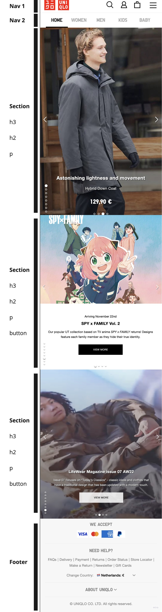
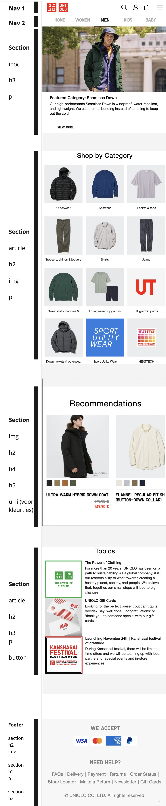
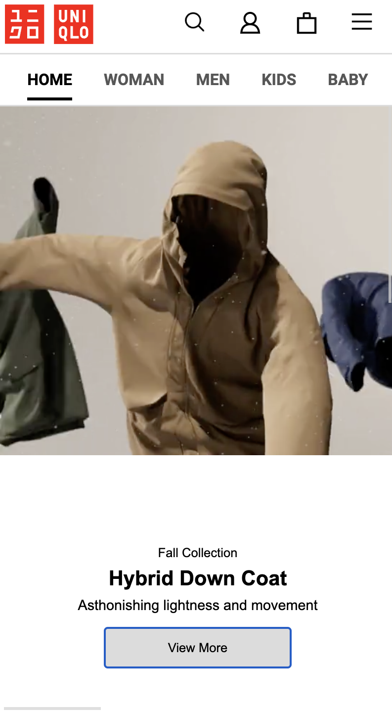
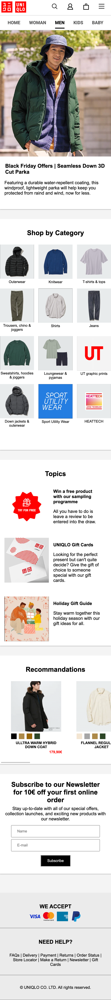
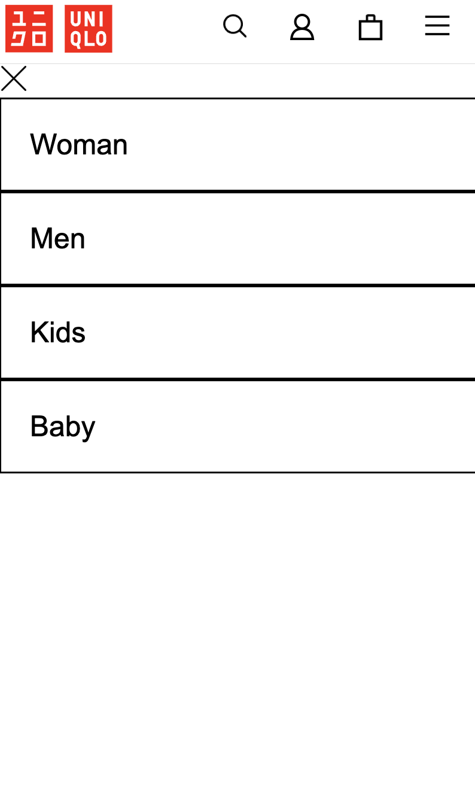

# Procesverslag
Markdown is een simpele manier om HTML te schrijven.  
Markdown cheat cheet: [Hulp bij het schrijven van Markdown](https://github.com/adam-p/markdown-here/wiki/Markdown-Cheatsheet).

Nb. De standaardstructuur en de spartaanse opmaak van de README.md zijn helemaal prima. Het gaat om de inhoud van je procesverslag. Besteedt de tijd voor pracht en praal aan je website.

Nb. Door *open* toe te voegen aan een *details* element kun je deze standaard open zetten. Fijn om dat steeds voor de relevante stuk(ken) te doen.

## Jij

  
uitwerken voor kick-off werkgroep

  ### Auteur:
  Jayden Ho 

  #### Je startniveau:
  Mijn niveau zit tussen de blauwe en rode piste, maar als ik een van 
  de twee moest kiezen zit ik toch wel meer bij de blauwe piste nog.

  #### Je focus:
  Ik vind het werken aan surface plane leuker denk ik, maar denk dat mijn mijn niveau aan coderen de responsiveness wat makkelijker zal gaan, al zou ik als uitdaging de surface plane ook goed proberen uit te werken.

  15-12-2022: ben uiteindelijk toch verder gegaan met surface plane uitwerken
 

## Je website

  
Uniqlo webshop wil ik gaan namaken, de homepage en de shop page van heren.

  ### Je opdracht:
  link naar homepagina: https://www.uniqlo.com/eu/en/home
  link naar shoppagina: https://www.uniqlo.com/eu/en/men

  #### Screenshot(s) van de eerste pagina (small screen): 
Home pagina
  

 #### Screenshot(s) van de eerste pagina (desktop screen): 
Home pagina
  

  #### Screenshot(s) van de tweede pagina (small screen):
Shop pagina
  

   #### Screenshot(s) van de tweede pagina (desktop screen): 
Home pagina
  
 

## Toegankelijkheidstest 1/2 (week 1)

  
uitwerken na test in 1e werkgroep

  ### Bevindingen
  Het is heel irritant, je krijgt in een keer de hele menu voorgelezen en die neemt dan elk categorie per afdeling door en dat zijn er heel veel. Maar het werkte wel zoals het moest werken.

  #### Screenreader
  Met VoiceOver ging ik door de website van Uniqlo, en het begon direct met
  alles voor te lezen van de website en alle categorieën op te noemen.
 
  

  #### Muis en Toetsenbord 
  Hier korte omschrijving (met indien nodig afbeeldingen)

  Hier een omschrijving van hoe het opgelost kan worden (met indien nodig afbeeldingen)

  #### Motoriek (shocks, elastiekjes)
  Hier korte omschrijving (met indien nodig afbeeldingen)

  Hier een omschrijving van hoe het opgelost kan worden (met indien nodig afbeeldingen)

  #### Visueel (brillen, contrast, kleurenblind, dark/light). 
  Hier korte omschrijving (met indien nodig afbeeldingen)

  Hier een omschrijving van hoe het opgelost kan worden (met indien nodig afbeeldingen)

## Breakdownschets (week 1)

  
uitwerken na afloop 2e werkgroep

  ### de hele pagina: 
  

  

  ### dynamisch deel (bijv menu): 
  

## Voortgang 1 (week 2)

  
uitwerken voor 1e voortgang

  ### Stand van zaken
  Er moet nog veel gebeuren, te lang bezig geweest met de carousel en had beter door kunnen gaan.

  ### Agenda voor meeting
  samen met je groepje opstellen
  dit hadden we niet gedaan bij de voortgang. We werkte allemaal door en stelde vragen bij de studentenassistent als er vragen waren           |

  ### Verslag van meeting
  hier na afloop snel de uitkomsten van de meeting vastleggen

  - punt 1: Tip om niet teveel bij de carousel te blijven, de website die je nou bouwt
  heeft een ingewikkelde slider die je voor jezelf kan versimpelen. Officiele website heeft een slider dat links en recht gaat
  dat weer in een andere slider zit die verticaal naar boven en beneden gaat. Tip was om dat dus alleen maar horizontaal te laten
  en de verticale eruit te laten.
  - punt 2: Niet te lang vast blijven zitten bij een onderdeel en te moeilijk maken voor jezelf.
  - 

## Voortgang 2 (week 3)

  
uitwerken voor 2e voortgang

  ### Stand van zaken
  De homepage gaat de goede kant op, en kan binnenkort wel afgerond worden omdat het nu een kwestie is van
  copy pasten. Andere pagina moet nog veel aan gedaan worden maar daar is vooral grid het onderdeel en de rest in die
  pagina is gewoon content goed plaatsen en vormgeven. 

  ### Agenda voor meeting
  samen met je groepje opstellen
  Deze voortgang les hebben we zonder gedaan.
  NIET VAN TOEPASSING

  ### Verslag van meeting
  hier na afloop snel de uitkomsten van de meeting vastleggen

  - punt 1 De volgorde van h2 en h3 en de p op homepagina anders doen, nu is er bottom gebruikt maar
  op de li een display flex zetten, met flex-direction: column en dan kun je met li h3 de property order de volgorde wijzigen. 
  Dus li h2 een latere nummer geven in de order dan h3 (CSS tricks flexbox ultimateguide)
-

## Toegankelijkheidstest 2/2 (week 4)

  
uitwerken na test in 8e werkgroep

  ### Bevindingen
  Lijst met je bevindingen die in de test naar voren kwamen (geef ook aan wat er verbeterd is):

  #### Screenreader
  Hier korte omschrijving (met indien nodig afbeeldingen)
  Het is ingewikkeld omdat ik de screenreader niet zo goed begrijp, maar als de website toegankelijk is en je de werking van screenreader gebruikt zal het wel eens goed kunnen werken, ook al blijft het minder fijn dan zonder screenreader.

  Hier een omschrijving van hoe het opgelost kan worden (met indien nodig afbeeldingen)
  Mijn code semantisch schrijven, zal ervoor zorgen dat de screenreader beter werkt.

  #### Muis en Toetsenbord 
  Hier korte omschrijving (met indien nodig afbeeldingen)

  Hier een omschrijving van hoe het opgelost kan worden (met indien nodig afbeeldingen)

  #### Motoriek (shocks, elastiekjes)
  Hier korte omschrijving (met indien nodig afbeeldingen)
  Het was heftiger dan ik dacht, als je op je telefoon door de uniqlo website gaat dan kom je met die schokken moeilijk bij de navigatie, maar onderin bij je telefoon kom je wel gemakkelijk bij en heb je daar wel controle over. Om te typen moet je ook erg concentreren omdat je anders uitschiet, en sliders schiet je ook uit. Conclusie is dat je niet zo'n goed controle meer hebt over je vingers.

  Lezen is wat moeilijker bij kleine lettertjes omdat je constant trilt en schud. 

  Hier een omschrijving van hoe het opgelost kan worden (met indien nodig afbeeldingen)
  De oplossing rondom de kleine letters is om die kleine lettertjes gewoon te vergroten. En voor mensen met epilepsie of andere schokken is er een oplossing om in je css "prefers-reduced-motion" en dan functies met animaties wat afleidend is voor mensen met concentratie problemen en scroll met snap functie uit te zetten als de gebruiker dat heeft aan staan in zijn instellingen. 

  #### Visueel (brillen, contrast, kleurenblind, dark/light). 
  Hier korte omschrijving (met indien nodig afbeeldingen)

  Concentratie problemen, terwijl je een ballon hoog houdt. Dit zorgt ervoor dat je niet kan lezen en elke keer moet zoeken waar je bent gebleven met het lezen. Het lezen uberhaupt erg moeilijk omdat je moet concentreren op de kleine letters en je bent hele tijd afgeleid.

  De brillen:
  Ouderdoms bril gaf me vooral hoofdpijn en duizeligheid, want je ziet hele tijd vlekken.
  De blurbril maakt alles erg onduidelijk je ziet zo goed als niks, zo wazig is het.
  Central field loss maakt het heel moeilijk om van afstand te zien, maar als je dichterbij het scherm gaat is het wel goed genoeg zichtbaar
  Hemifield loss zie je een helft niets, maar de andere helft is nog net zo goed zichtbaar dus dat kan je wel volgen.
  Laag contrast bril zorgde ervoor dat ik tekst op de navbar niet meer kon lezen dus de dingen die laag contrast waren, waren niet meer zichtbaar.

  Hier een omschrijving van hoe het opgelost kan worden (met indien nodig afbeeldingen)
  Lettertypes vergroten en iets om bij te houden waar je bent gebleven is wel handig, alleen kom ik nog niet precies op wat ervoor zou kunnen doen.

  De beste oplossing voor mensen die zichtbeperking hebben zijn screenreaders. Ik heb ook de lettertypes wat bolder en donkerder gemaakt zoals de h2's en de nav menu, die zijn bij het origineel lichter.

## Voortgang 3 (week 4)

  
uitwerken voor 3e voortgang

  ### Stand van zaken
  Content is zo goed als compleet, er komt nu nog alleen herhalende onderdelen. Wel mist het javascript nog volledig, en hamburger menu en zoekbalk. En de keuze is gemaakt om uiteindelijk toch voor een surface plane te gaan.

  ### Agenda voor meeting
  samen met je groepje opstellen
  NIET VAN TOEPASSING

  ### Verslag van meeting
  hier na afloop snel de uitkomsten van de meeting vastleggen

  - punt 1
  Goed bezig, alleen nog het javascript gedeelte
  - punt 2
  Denk aan de Surface Plane

## Eindgesprek (week 5)

  
uitwerken voor eindgesprek

  ### Je uitkomst - karakteristiek screenshots: 
  
  

  

  Niet helemaal gelukte Hamburger menu
  
  

  ### Dit ging goed/Heb ik geleerd: 
  Ik vond dit project/opdracht heel leuk om te doen, vooral door de hoeveelheid vrijheid en dat je echt een website mocht nabouwen die je zelf leuk vond. 

  Ik heb veel geleerd over de toegankelijkheid van websites en vond dit erg interessant. Ik ben na dit project ook het coderen een stuk leuker gaan vinden.

  Kwa vormgeving is het me helemaal gelukt om mijn 2 pagina's te krijgen zoals ik wilde en van plan was, het mist alleen bepaalde functies die ik had willen toevoegen maar me niet gelukt is.

  ### Dit was lastig/Is niet gelukt:
  In verband met tekort aan tijd zijn wat dingen mij niet gelukt. Ik heb geprobeerd een hamburger menu werkent te maken maar dat is dus niet helemaal gelukt, hij werkt alleen vervangt het kruis van hamburgermenu sluiten niet de hamburger menu. Hier liep ik mee vast en kon er niet verder op ingaan ivm tekort aan tijd.

  Ook wilde ik dat als er op de searchglass drukte er een zoekbalk zou verschijnen en je daarin kon typen, maar dit is me niet gelukt, want ik liep vast bij het gedeelte van een zoekbalk laten verschijnen.

  Voor de extra surface plane wilde ik de afbeeldingen bij topic een kwartslag laten draaien elk 2seconden.

  Ook wilde ik nog audio toevoegen als surface plane, maar het lukte net niet, de code was goed maar al mijn zelfgemaakte en gedownloade audios konden niet worden geopend in Visual Studio Code, waardoor ik dit toch weg moest halen.

  Ik had graag prefers-reduced-motion uitgebreider uitgewerkt, maar daarvoor had ik ook die animaties nodig die ik wilde doen op mijn website, dan kon ik dat uitzetten voor mensen met de voorkeur prefers-reduced-motion.

## Bronnenlijst

  
continu bijhouden terwijl je werkt

  Nb. Wees specifiek ('css-tricks' als bron is bijv. niet specifiek genoeg).

  Bronnenlijst:
  1. Studenassistent Nina heeft me vooral geholpen en de uitgelegd hoe je de scroll op home laat werken
  2. Nina heeft me ook geholpen een stukje javascript te schrijven voor de footer, dat die niet bleeft plakken bij het scrollen op de homepagina, dus dat de overflow alleen werkt als de footer niet in beeld is.
  3. https://codepen.io/shooft/pen/vYRjoxG (uitwerking van Sanne heeft me geholpen en de grid leren te begrijpen)
  4. Bahaa heeft me geleerd hoe je kleurvakjes kon doen bij de recommandations bij herenpagina.
  5. https://developer.mozilla.org/en-US/docs/Web/CSS/@media/prefers-reduced-motion hier heb ik van hoe je prefers-reduced-motion laat werken https://developer.mozilla.org/en-US/docs/Web/CSS/@media/prefers-reduced-motion
  6. Isabel Kok heeft mij geholpen met de hamburger menu en de javascript code uitgelegd

